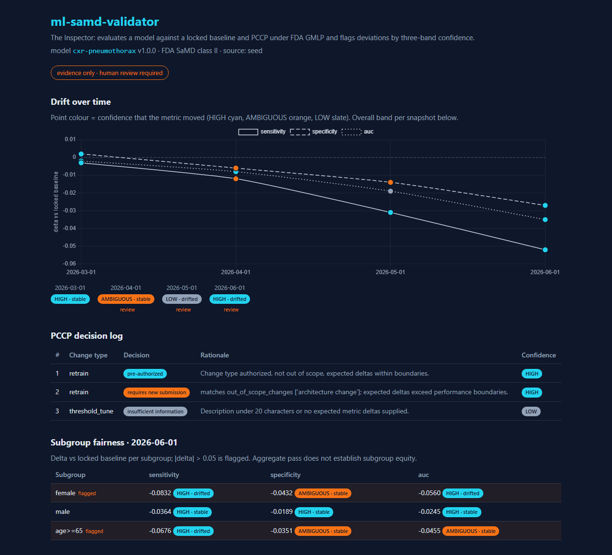
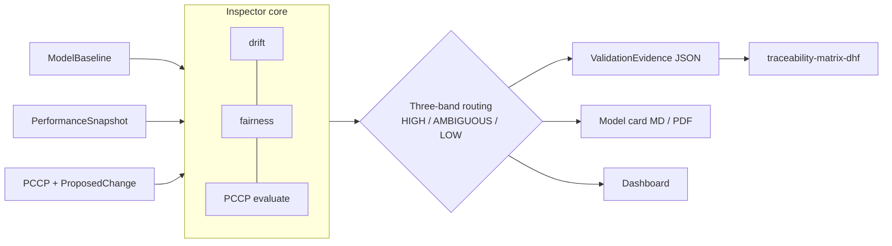

# ml-samd-validator

[](https://github.com/LSaiko/ml-samd-validator/actions/workflows/ci.yml)
[](LICENSE)
[](https://LSaiko.github.io/ml-samd-validator/)


**Drift evidence for FDA-regulated ML: proves a deployed model stayed inside its
Predetermined Change Control Plan, or flags where it did not.**

A machine-learning model in a medical device keeps changing after it ships: the patients,
scanners, and sites it sees drift away from its test data, so its accuracy moves even though
nobody edited any code. The FDA's Predetermined Change Control Plan (PCCP) lets a
manufacturer pre-authorize a bounded set of such changes instead of re-filing for every
retrain, in exchange for proof that the model stayed inside the bounds. This tool produces
that proof: from a locked baseline and periodic performance snapshots it reports, with
explicit statistical confidence, whether the model drifted, whether a proposed change is
covered by the PCCP, and whether any patient subgroup is under-served, as an auditable
evidence package for a human reviewer to sign off.

## Contents

- [Core use case](#core-use-case)
- [What it does](#what-it-does)
- [Architecture](#architecture)
- [Setup](#setup)
- [API](#api)
- [Regulatory framing](#regulatory-framing)
- [Interview talking points](#interview-talking-points)
- [Related projects](#related-projects)
- [Interview Q&A](#interview-qa)
- [License](#license)

## Core use case

A manufacturer ships a chest-X-ray triage model (FDA SaMD class II) with a PCCP that
pre-authorizes quarterly retraining as long as sensitivity, specificity, and AUC stay within
±0.02 of the locked baseline. Each quarter the monitoring pipeline exports summary metrics
per site and demographic subgroup — no raw scores, no PHI — and the regulatory team needs
an answer to three questions before the next retrain is deployed:

1. **Did the deployed model drift?** `POST /snapshot` scores every metric against the locked
   `ModelBaseline` and returns a verdict (`stable` / `drifted`) with a confidence band.
   A well-powered unchanged model passes through as HIGH; a thin sample is reported as
   LOW rather than silently called "fine".
2. **Is the proposed retrain still covered by the PCCP?** `POST /pccp/evaluate` returns
   `pre-authorized`, `requires new submission`, or `insufficient information`, with the
   boundary that was violated if any.
3. **Is any subgroup being under-served while the aggregate passes?** The fairness check
   flags each subgroup × metric that exceeds the threshold, with its own confidence band.

`GET /model-card/{model_id}` then bundles all of it into a `ValidationEvidence` JSON
(plus Markdown/PDF model card) with IEC 62304 safety class and ISO 14971 hazard callouts,
ready to be attached to the Design History File as objective evidence for a human
reviewer's sign-off. The tool never makes the go/no-go call; it makes the call auditable.

## What it does

- Locks a `ModelBaseline` (metrics, dataset hash, FDA SaMD risk class) and ingests
  `PerformanceSnapshot`s over time.
- Runs drift detection per metric with a two-proportion z-test and routes each finding
  through three confidence bands (HIGH / AMBIGUOUS / LOW).
- Evaluates a `ProposedChange` against the PCCP: **pre-authorized**, **requires new
  submission**, or **insufficient information**.
- Checks subgroup fairness so a passing aggregate cannot hide a failing subgroup.
- Emits a GMLP-aligned model card as Markdown, PDF, and a versioned `ValidationEvidence`
  JSON export (`docs/validation-evidence-schema.md`) for downstream DHF tooling.
- React dashboard: drift over time, PCCP decision log, subgroup fairness; runs in
  seed mode with no backend for the GitHub Pages demo.
- Every report carries IEC 62304 software safety class and ISO 14971 hazard language,
  and the disclaimer that it is evidence, not a release decision.

[](https://LSaiko.github.io/ml-samd-validator/)

_Click the screenshot to open the live demo (seeded with synthetic data, no backend required)._

## Architecture



Details, band definitions, and the statistics rationale: [docs/architecture.md](docs/architecture.md).

## Setup

```bash
# backend (Python >= 3.12)
pip install -e .[dev]
uvicorn app.main:app --reload          # http://127.0.0.1:8000/docs

# dashboard (Node 22)
cd dashboard && npm ci && npm run dev  # seed mode unless VITE_API_BASE is set

# checks (what CI runs)
ruff check . && mypy app schemas && pytest --cov=app --cov=schemas --cov-branch
cd dashboard && npx tsc --noEmit && npm run build
```

| Env var | Where | Purpose |
|---|---|---|
| `ALLOWED_ORIGINS` | backend | Comma-separated CORS origins (default `*`) |
| `VITE_API_BASE` | dashboard | Backend URL; unset = built-in seed data |
| `VITE_MODEL_ID` | dashboard | Model to display (default: seed model) |
| `VITE_BASE` | dashboard build | URL subpath, e.g. `/ml-samd-validator/` for Pages |

## API

| Method | Path | Body / query | Returns |
|---|---|---|---|
| GET | `/health` | | `{"status": "ok"}` |
| POST | `/baseline` | `ModelBaseline` | stored baseline |
| POST | `/pccp` | `PredeterminedChangeControlPlan` | stored PCCP |
| POST | `/snapshot` | `PerformanceSnapshot` | snapshot + `DriftReport` + `FairnessReport` |
| GET | `/drift/{model_id}` | | drift + fairness per snapshot, time-ordered |
| POST | `/pccp/evaluate` | `ProposedChange` | `PccpDecision` |
| GET | `/pccp/log/{model_id}` | | decision history |
| GET | `/model-card/{model_id}` | `?format=json\|markdown` | `ValidationEvidence` or Markdown card |

## Regulatory framing

- **IEC 62304 safety class** is derived from the FDA SaMD risk class: I -> A, II -> B,
  III/IV -> C, marked provisional pending the manufacturer's hazard analysis.
- **ISO 14971**: each drift beyond a boundary, non-HIGH band, or flagged subgroup is recorded
  as a hazardous situation; the risk control is mandatory human review before deployment.
- **GMLP**: the model card carries a checklist over the ten FDA/Health Canada/MHRA principles
  (representative data, independent test sets, deployed-model monitoring, ...).
- **Three-band routing** on every finding. Each metric gets a verdict against a tolerance
  (PCCP `max_delta`, default 0.02): `drifted` with confidence `1 - p`, or `stable` with
  confidence = probability the true delta is within tolerance (equivalence test). HIGH
  (>= 0.80) stable passes through, HIGH drifted is flagged; AMBIGUOUS (0.55-0.79) flagged for
  human interpretation with reasoning attached; LOW (< 0.55) insufficient evidence, no
  conclusion asserted. A report's overall band is the worst band present.
- **Inspector disclaimer**: the tool never trains models, never classifies clinical inputs,
  and never issues a go/no-go decision. It produces evidence and flags deviations.

## Interview talking points

**Why PCCP matters for ML specifically.** Conventional device software only changes when
someone changes the code, so change control is a code-review problem. An ML model's
behaviour changes when its input population changes, and a retrain is a planned behaviour
change with no meaningful diff to review. PCCP answers this by pre-authorizing a change
envelope (what may change, how it is validated, what performance bounds apply); the
manufacturer's obligation shifts from "file again" to "prove you stayed inside the
envelope". That proof is exactly what this tool generates.

**The three-band design.** A binary pass/fail on a p-value throws away the difference
between "we know it moved", "it might have moved but the sample is thin", and "we cannot
tell". Mapping confidence to three bands lets the tool pass through only strongly supported
findings, hand ambiguous ones to a reviewer with the reasoning attached, and refuse to
assert anything on weak evidence. Confidence is confidence in the *verdict*, not in
"something moved": `1 - p` is the wrong number for a stable model, because a failure to
reject is not evidence of equivalence, so a stable verdict is scored with an equivalence
(TOST-style) probability that the true delta sits inside the tolerance. A well-powered
unchanged model is then HIGH and passes through; a tiny sample that cannot rule out drift is
LOW. It is a deliberate encoding of the Inspector role: the tool must not be the one that
quietly says "fine".

**One concrete trade-off: z-test on summary metrics vs PSI/KS on score distributions.**
Snapshots carry summary metrics and a sample size, not raw prediction scores, because that
is what a monitoring pipeline can usually export without a PHI conversation. So drift is
measured with a two-proportion z-test (pooled SE) on each metric, and the absence of drift
with the matching equivalence probability. What that gives up: PSI or
KS on the score distribution would detect input/output shift before it shows up in labelled
metrics, but needs the raw scores; the z-test assumes independent samples and a normal
approximation, which is weak for small subgroups (they correctly land in lower bands); and
`calibration_slope` has no closed-form SE without the raw data, so it uses a documented
`1/sqrt(n)` approximation.

## Related projects

- [SaMD-Val-Kit](https://github.com/LSaiko/SaMD-Val-Kit): validation protocol templates
  and V&V planning for SaMD.
- [traceability-matrix-dhf](https://github.com/LSaiko/traceability-matrix-dhf) (in
  progress): consumes the `ValidationEvidence` JSON and links each finding to design-history
  file requirements.

## Interview Q&A

**Why doesn't the tool make a go/no-go decision?** Under ISO 14971 the acceptability of
residual risk is a manufacturer decision made by qualified people; a tool that auto-releases
would itself become a risk control that needs validation to a higher class. Keeping the
tool as an evidence producer keeps its IEC 62304 exposure bounded and keeps accountability
where the regulation puts it.

**What happens when aggregate metrics pass but a subgroup fails?** `FairnessReport` reports
`aggregate_passed = true` and `any_flagged = true` side by side, and the flagged subgroup's
finding carries its own band and sample size. Both flags are exported in the evidence
package and rendered in the dashboard, so a passing aggregate cannot hide the subgroup from
the reviewer. This is the GMLP "representative data" principle made operational.

**How would you extend the PCCP evaluator for a real 510(k) submission?** Replace the
keyword match on `out_of_scope_changes` with a structured change taxonomy from the
manufacturer's modification protocol; tie each `PerformanceBoundary` to the specific
validation dataset and acceptance criterion in the submission; add the "impact assessment"
section (benefit-risk of each change type) and a signed-off decision log with reviewer
identity; and persist everything so the log is tamper-evident.

**How does evidence feed into a DHF?** `ValidationEvidence` is a versioned JSON export
(`schema_version`, `evidence_id`, `requirement_ids`). A traceability tool links each drift
or fairness finding to the design-input requirement it verifies, so an auditor can walk from
a requirement to the snapshot, the test statistic, the band, and the human disposition.

## License

MIT, see [LICENSE](LICENSE).
