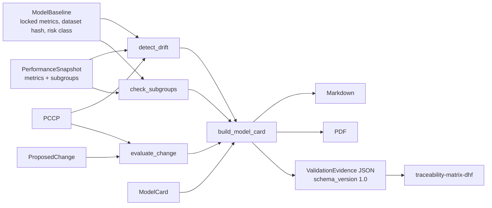

# Architecture

Part of [ml-samd-validator](../README.md); see the README for setup, API, and regulatory framing.

`ml-samd-validator` implements the Inspector role: it evaluates a model's performance
snapshots against a locked baseline and a Predetermined Change Control Plan (PCCP), and emits
structured evidence for human review. It never trains models, never classifies raw clinical
inputs, and never issues an autonomous go/no-go decision.

IEC 62304 software safety classification and ISO 14971 risk management language appear in
every evaluation report (`DriftReport`, model card, `ValidationEvidence`); the sections below
define how each is derived.

Modules: `schemas/models.py` (Pydantic v2, `extra="forbid"`), `app/core.py` (drift, PCCP,
fairness), `app/report.py` (model card, PDF, JSON export), `app/main.py` (FastAPI).

## Three-band confidence routing

Every finding a human may act on carries `confidence = 1 - p_value` and a band:

| Band | Confidence | Routing |
|---|---|---|
| HIGH | >= 0.80 | pass-through; statistically supported |
| AMBIGUOUS | 0.55-0.79 | flag for human interpretation, reasoning attached |
| LOW | < 0.55 | insufficient evidence; no conclusion asserted |

A report's `overall_band` is the worst band present. `requires_human_review` is true unless the
overall band is HIGH and no PCCP performance boundary is exceeded.

## Statistical test choice

Snapshots carry metric-level summary statistics (sensitivity, specificity, AUC, F1,
calibration slope) plus a sample size, not raw score distributions, so PSI/KL divergence is not
applicable. Proportion-like metrics use a two-proportion z-test with pooled standard error
between the baseline and snapshot cohorts (`scipy.stats.norm`, two-sided p). Calibration slope
uses a one-sample-style z with SE approximated as `1/sqrt(n)`, a documented `ponytail:`
simplification because the slope's SE requires the raw predictions. Subgroups reuse the same
test with the subgroup's own `sample_size`, so small subgroups naturally land in lower bands.

## IEC 62304 software safety classification

The IEC 62304 software safety class is derived from the FDA SaMD risk class of the baseline:
I -> A (no injury possible), II -> B (non-serious injury possible), III/IV -> C (death or
serious injury possible). The class is provisional pending the manufacturer's hazard analysis
and is reproduced in every drift report, model card, and JSON export.

## ISO 14971 risk management

Observed performance deviations (drift beyond a boundary, non-HIGH bands, flagged subgroups)
are recorded as hazards. The primary risk control is human review of each flagged finding
before any deployment decision; PCCP boundaries and the locked dataset hash are supporting
controls. Residual risk is accepted only after a qualified reviewer disposes each finding, and
the evidence package states explicitly that it asserts no go/no-go decision.
